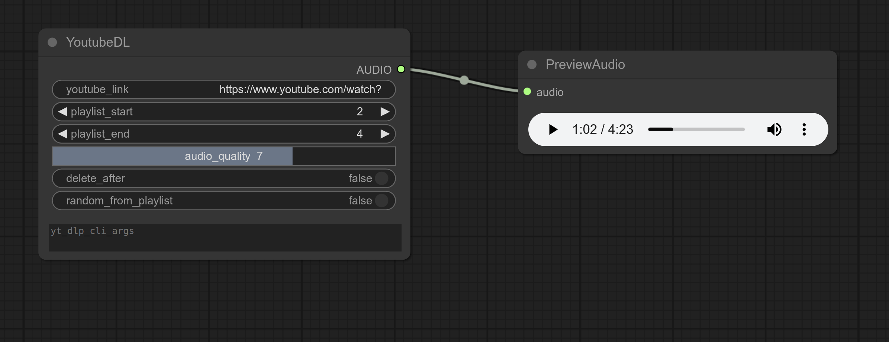

# youtube-dl-comfyui

Download youtube videos/playlists



## Install

1. `cd` to `ComfyUI/custom_nodes`
1. `git clone` this repository
2. `cd` into the repository
3. `pip install -r requirements.txt`

## Usage

If you provide a link to a playlist, the videos from `playlist_start` to `playlist_end` will be downloaded and output in a batch.

You can use any of the [yt-dlp cli options](https://github.com/yt-dlp/yt-dlp?tab=readme-ov-file#usage-and-options)

## Requirements

```
yt-dlp
```

