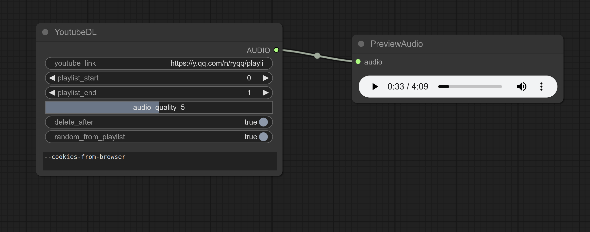
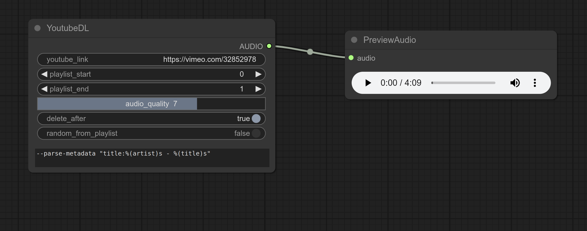

# youtube-dl-comfyui

Download media from url.






## Install

1. `cd` to `ComfyUI/custom_nodes`
1. `git clone` this repository
2. `cd` into the repository
3. `pip install -r requirements.txt`

## Usage

If you provide a link to a playlist, the videos from `playlist_start` to `playlist_end` will be downloaded and output in a batch.

You can use any of the [yt-dlp cli args](https://github.com/yt-dlp/yt-dlp?tab=readme-ov-file#usage-and-options) for configuration.

### 使用代理 Use with Proxy

你可以简单地将以下命令添加到 `yt_dlp_cli_args` 文本框中：

```bash
--proxy "socks5://127.0.0.1:1080"
```

[所有代理选项](https://github.com/yt-dlp/yt-dlp?tab=readme-ov-file#network-options) &nbsp; | &nbsp;  [地理限制选项](https://github.com/yt-dlp/yt-dlp?tab=readme-ov-file#geo-restriction)。


## Requirements

```
yt-dlp
```

